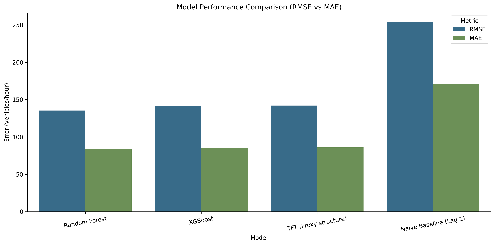
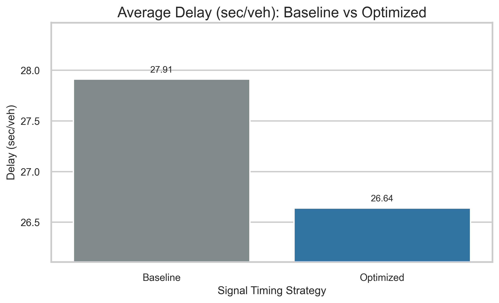
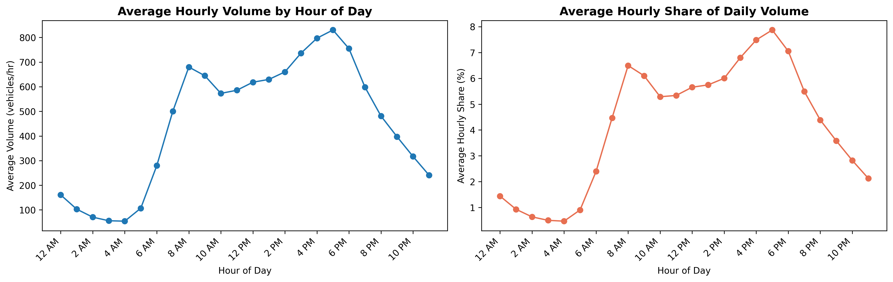
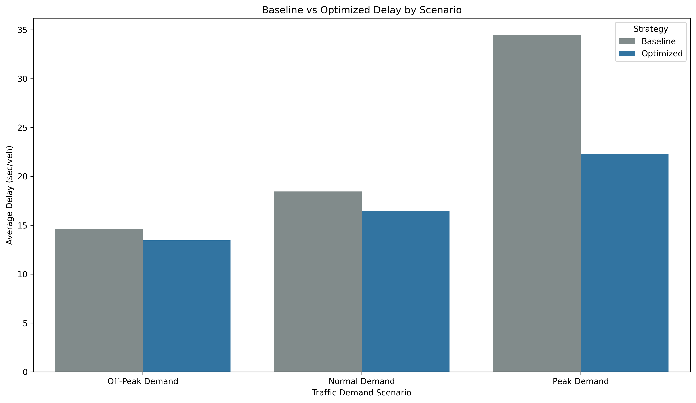
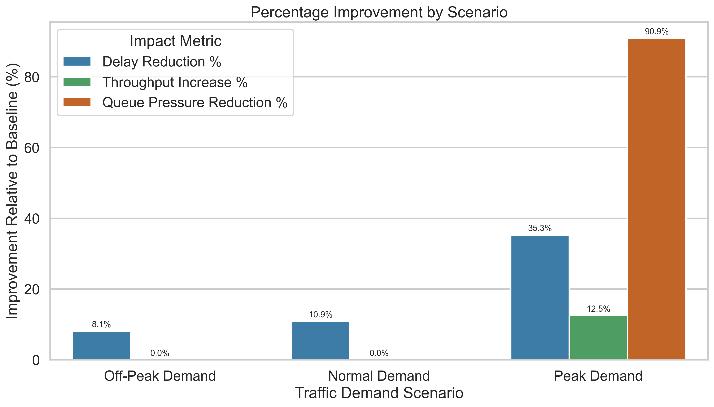

# Smart City Traffic Signal Timing Optimization and Simulation (Toronto)

This project develops a data-driven traffic signal optimization framework using machine learning, traffic analytics, and operations research methods.
It combines forecasting with signal timing strategy evaluation and simulation to quantify operational impact under realistic demand scenarios.
Using Toronto traffic data, the workflow supports academically grounded and reproducible smart-city traffic decision support.

## Capstone Project — University of Niagara Falls (UNF)

This repository presents an end-to-end traffic analytics and signal timing workflow using City of Toronto historical traffic data (2015-2019 baseline).

The project integrates data preprocessing, congestion metric design, forecasting, optimization formulation, strategy comparison, simulation, and impact evaluation to support data-driven signal timing insights.

## Academic Context / Team

### Program Context

Master of Data Analytics, University of Niagara Falls (UNF)

### Team Members

- Manav Parikh
- Dhyey Modi
- Rudra Patel
- Arpit Desai

### Supervisor

Dr. Hany Osman  
hany.osman@unfc.ca

## Project Overview

Traffic count records and traffic signal infrastructure data exist in separate sources and must be connected before operational analysis is possible.

This project builds a reproducible analytics system that:

- prepares raw traffic data into modeling-ready datasets,
- defines and computes traffic congestion and signal performance metrics,
- forecasts near-term traffic volume,
- evaluates baseline versus optimized timing strategies,
- simulates intersection-level outcomes,
- and quantifies operational impact.

## Problem Definition

Traffic count locations and signalized intersections in Toronto Open Data do not share a common identifier. To support signal timing analysis, the project links these datasets through geographic matching and then applies forecasting and operations-oriented evaluation.

## Objectives

- Analyze recurring historical traffic demand patterns across Toronto count locations.
- Define interpretable congestion and traffic flow indicators.
- Map traffic count locations to nearby signalized intersections.
- Engineer optimization-oriented features for downstream modeling.
- Compute signal performance metrics at intersection level.
- Develop next-hour traffic congestion and volume forecasting models.
- Compare baseline and optimized signal timing strategies.
- Integrate external temporal and weather factors.
- Simulate intersection behavior under multiple demand scenarios.
- Evaluate operational impact for decision-support reporting.

## Full Methodology / Pipeline

### End-to-End Pipeline

```text
Raw Data
  -> Preprocessing
  -> Validation
  -> Congestion Metric Definition
  -> EDA
  -> Feature Engineering
  -> Signal Performance Metrics
  -> Forecasting
  -> Baseline Strategy
  -> Optimization Formulation
  -> Strategy Comparison
  -> External Factors Integration
  -> Intersection Simulation
  -> Impact Evaluation
```

### Notebook-to-Pipeline Mapping (All Notebooks)

| Notebook                                         | Role in Pipeline                                                                   |
| ------------------------------------------------ | ---------------------------------------------------------------------------------- |
| `00_raw_preprocessing.ipynb`                     | Cleans raw 15-minute records and creates hourly/daily processed datasets.          |
| `01_define_congestion_metric.ipynb`              | Defines congestion-oriented metrics used for traffic condition interpretation.     |
| `02_dataset_validation.ipynb`                    | Validates temporal coverage, spatial coverage, completeness, and data suitability. |
| `03_eda_traffic_data.ipynb`                      | Explores temporal/spatial traffic demand patterns and peak behavior.               |
| `04_feature_engineering.ipynb`                   | Builds model-ready temporal, demand, and signal-mapping features.                  |
| `05_signal_performance_metrics.ipynb`            | Derives signal performance indicators for operational analysis.                    |
| `06_baseline_signal_timing.ipynb`                | Establishes baseline fixed-time timing assumptions and benchmark metrics.          |
| `07_traffic_congestion_volume_forecasting.ipynb` | Trains and compares next-hour forecasting models.                                  |
| `08_signal_timing_strategy_comparison.ipynb`     | Compares baseline and optimized timing strategies under forecast-informed demand.  |
| `09_external_factors_integration.ipynb`          | Integrates hourly weather and temporal external factors with traffic data.         |
| `10_traffic_flow_optimization_formulation.ipynb` | Documents objective, decision variables, and constraints for optimization framing. |
| `11_intersection_traffic_flow_simulation.ipynb`  | Simulates intersection outcomes under baseline vs optimized timing scenarios.      |
| `12_signal_timing_impact_evaluation.ipynb`       | Quantifies before-vs-after operational impact and exports evaluation outputs.      |

## Data Sources

### City of Toronto Open Data Portal

- Traffic Volume — Speed Volume Classification (SVC)
- Traffic Signals dataset

### Meteostat Weather Data

Hourly weather observations used to enrich traffic demand modeling with external environmental factors.

These datasets are used for academic research purposes.

## Notebook Execution Order

### Core Pipeline Notebooks

Execute in this order for the full end-to-end workflow:

1. `notebooks/00_raw_preprocessing.ipynb`
2. `notebooks/01_define_congestion_metric.ipynb`
3. `notebooks/03_eda_traffic_data.ipynb`
4. `notebooks/04_feature_engineering.ipynb`
5. `notebooks/05_signal_performance_metrics.ipynb`
6. `notebooks/06_baseline_signal_timing.ipynb`
7. `notebooks/07_traffic_congestion_volume_forecasting.ipynb`
8. `notebooks/08_signal_timing_strategy_comparison.ipynb`
9. `notebooks/09_external_factors_integration.ipynb`
10. `notebooks/10_traffic_flow_optimization_formulation.ipynb`
11. `notebooks/11_intersection_traffic_flow_simulation.ipynb`
12. `notebooks/12_signal_timing_impact_evaluation.ipynb`

### Supporting / Auxiliary Notebooks

- `notebooks/02_dataset_validation.ipynb` (data quality and suitability validation)

## Forecasting

`notebooks/07_traffic_congestion_volume_forecasting.ipynb`

The forecasting stage predicts next-hour traffic volume and compares multiple model families. The notebook includes model comparison and ablation analysis to evaluate feature contribution under time-ordered validation.

Forecast outputs are used directly in downstream signal timing strategy comparison.


_Model comparison chart used to evaluate forecasting performance (RMSE and MAE)._

## Optimization

### Baseline Strategy

`notebooks/06_baseline_signal_timing.ipynb`

Defines a fixed-time benchmark strategy with explicit cycle and green allocation assumptions for comparative analysis.

### Optimization Formulation

`notebooks/10_traffic_flow_optimization_formulation.ipynb`

A simplified traffic signal optimization framework is specified with:

- **Objective:** minimize total intersection delay across movements.
- **Decision variables:** green-time allocations by phase (North-South and East-West).
- **Constraints:** cycle-length consistency, minimum green-time limits, and capacity-linked feasibility.

Interpretation remains operationally grounded: optimization redistributes available green time; it does not create new intersection capacity.

### Strategy Comparison

`notebooks/08_signal_timing_strategy_comparison.ipynb`

Compares baseline and optimized timing using forecast-informed demand, including:

- Webster-style delay estimation,
- throughput,
- queue pressure,
- peak-period and congestion-level analysis,
- location-level comparison summaries.


_Forecast-informed strategy comparison highlighting delay differences under baseline and optimized timing._

## Simulation

`notebooks/11_intersection_traffic_flow_simulation.ipynb`

Evaluates intersection behavior under multiple demand scenarios (Off-Peak, Normal, Peak) for baseline and optimized signal timing.

### Intersection Setup

- Two-phase signalized intersection:
  - Phase 1: North-South traffic
  - Phase 2: East-West traffic
- Cycle length held constant across strategies.

### Performance Metrics

- Average Delay (sec/veh)
- Throughput (veh/hr)
- Queue Pressure (Demand - Capacity)
- Demand Served per Cycle (veh/cycle)
- Queue Pressure Ratio
- Volume-to-Capacity Ratio (V/C)


_Traffic demand context used to define simulation scenarios._

## Evaluation / Results

### Final Impact Evaluation

`notebooks/12_signal_timing_impact_evaluation.ipynb`

This stage converts simulation outputs into before-vs-after impact metrics for baseline and optimized timing.

Saved outputs:

- `data/processed/signal_timing_impact_summary.csv`
- `data/processed/signal_timing_headline_metrics.csv`
- `data/processed/signal_timing_congestion_level_summary.csv`
- `data/processed/location_signal_timing_improvement.csv`

### Headline Average Results Across Scenarios

| Metric                  |        Baseline |       Optimized |           Change |
| ----------------------- | --------------: | --------------: | ---------------: |
| Delay                   |   22.52 sec/veh |   17.40 sec/veh | 18.07% reduction |
| Throughput              |  1226.67 veh/hr |  1293.33 veh/hr |   4.17% increase |
| Queue Pressure          |    73.33 veh/hr |     6.67 veh/hr | 90.91% reduction |
| Demand Served per Cycle | 30.67 veh/cycle | 32.33 veh/cycle |   4.17% increase |

Interpretation summary:

- Largest benefits occur under peak/congested conditions.
- Lower-demand scenarios show smaller gains because operations are already below capacity.
- Observed changes come from better green-time redistribution within fixed capacity.


_Impact visualization showing baseline vs optimized delay across demand scenarios._


_Scenario-level percentage change view for delay reduction, throughput increase, and queue-pressure reduction._

## Example Performance Changes

Peak demand simulation results:

| Metric         |      Baseline |     Optimized |         Change |
| -------------- | ------------: | ------------: | -------------: |
| Average Delay  | 34.47 sec/veh | 22.30 sec/veh |  35% reduction |
| Throughput     |   1600 veh/hr |   1800 veh/hr | 12.5% increase |
| Queue Pressure |    220 veh/hr |     20 veh/hr |  90% reduction |

## External Factors Integration

`notebooks/09_external_factors_integration.ipynb`

Integrates hourly Meteostat weather and temporal indicators into the traffic dataset.

Included variables:

- temperature
- precipitation
- humidity
- pressure
- weekend indicator
- peak-hour indicator

Reported merge coverage: ~99.65%.

## Practical Implications

- Provides a reproducible framework for evaluating adaptive signal timing using historical and forecasted demand conditions.
- Supports urban transportation planning by quantifying delay, throughput, and queue-pressure changes under operationally realistic scenarios.
- Demonstrates how measurable traffic performance gains can be achieved through control strategy refinement rather than infrastructure expansion.
- Offers a transparent analytics pipeline that can be adapted for smart-city corridor screening and staged signal optimization studies.

## Web App and API

In addition to the notebook-based research pipeline, this repository includes an application layer for interactive exploration and live inference:

- `web/`: Next.js application (dashboard, forecasting, optimization views, hotspots, and route-planning experience).
- `api/`: FastAPI model service for live forecasting endpoints consumed by the web app.

### Local Run (Application Layer)

1. Configure web environment:

```bash
cd web
cp .env.example .env.local
```

Set these values in `web/.env.local`:

```env
MODEL_SERVICE_URL=http://127.0.0.1:8000
MODEL_SERVICE_TIMEOUT_MS=30000
NEXT_PUBLIC_ALLOW_FALLBACK_ON_ERROR=true
```

2. Run the web app:

```bash
cd web
npm install
npm run dev
```

3. Run the model API (separate terminal):

```bash
cd api
python3 -m venv .venv
source .venv/bin/activate
pip install -r requirements.txt
uvicorn app:app --reload --host 127.0.0.1 --port 8000
```

4. Verify integration:

```bash
curl http://127.0.0.1:8000/health
curl "http://localhost:3000/api/forecast?locationId=10133019_NB&horizonHours=6"
```

Integration notes:

- Web app default URL: `http://localhost:3000`
- Model API default URL: `http://127.0.0.1:8000`
- If you see `Unable to acquire lock at web/.next/dev/lock`, stop old Next.js processes and remove the lock: `pkill -f "next dev" && rm -f web/.next/dev/lock`.

Detailed docs:

- `web/README.md`
- `api/README.md`

### Web Application Screenshots


_Landing page introducing the smart-city traffic analytics product experience._


_Traffic intelligence dashboard with KPI summaries and congestion trends._


_Forecasting workflow showing demand predictions and comparative model behavior._


_Additional forecasting view highlighting scenario-specific forecast outputs._


_Baseline versus optimized timing strategy comparison interface._


_Route planning and scenario testing interaction for what-if traffic analysis._


_Additional scenario-testing result state for route-level evaluation._


_Methodology page connecting product features to the underlying research pipeline._

## Environment Setup

### Recommended Python

- Python 3.11 (TensorFlow compatible)

### Required Libraries

- pandas
- numpy
- matplotlib
- seaborn
- scikit-learn
- tensorflow
- meteostat
- geopy

### Installation

```bash
pip install pandas numpy matplotlib seaborn scikit-learn tensorflow meteostat geopy
```

## References

- Highway Capacity Manual (HCM), Transportation Research Board
- Webster, F. V. (1958). _Traffic Signal Settings_
- City of Toronto Open Data Portal
- Meteostat Weather Data API

## License

This repository is provided for academic and educational purposes as part of the UNF capstone program.

Traffic data originates from the City of Toronto Open Data Portal and remains subject to original dataset licensing terms.
