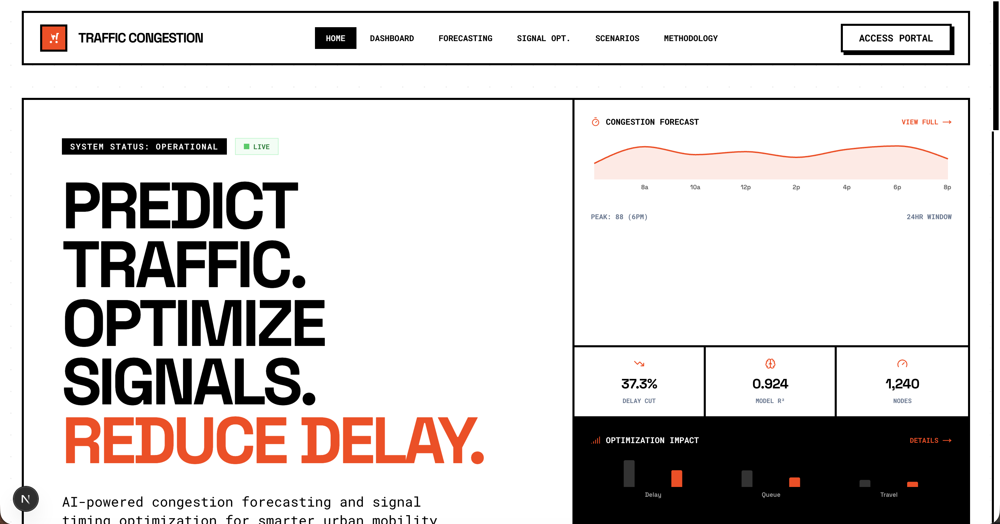
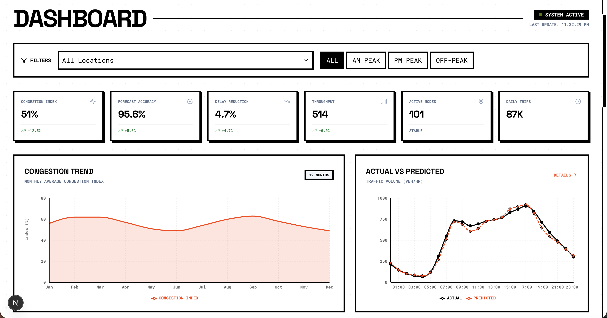
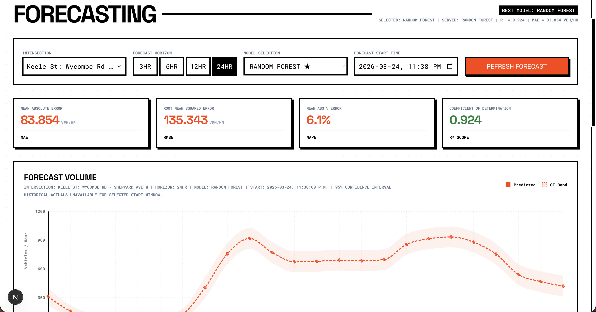
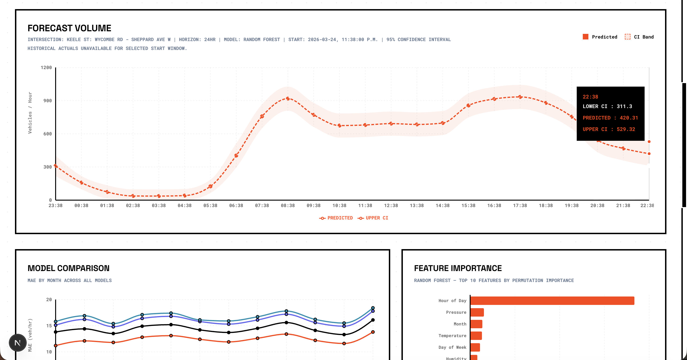
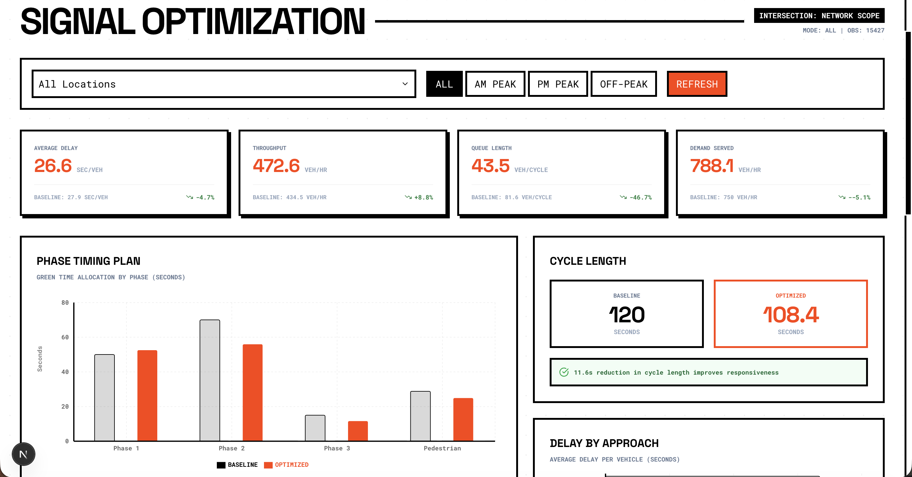
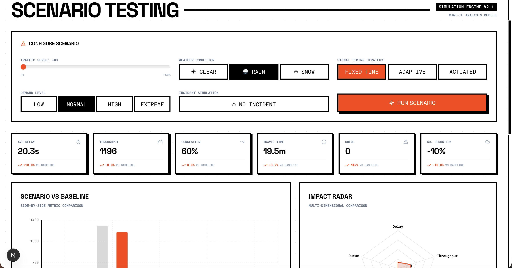
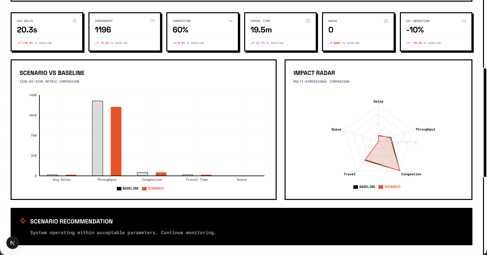
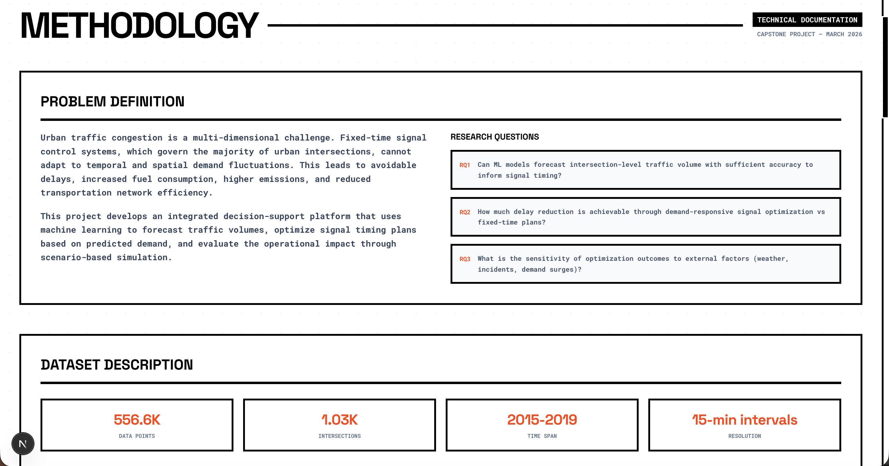

# Traffic Congestion

Traffic Congestion is a production-oriented Next.js smart-city SaaS demo for traffic forecasting, congestion analytics, signal optimization, hotspot exploration, and future-aware route planning.

## What is included

- Marketing landing page with product positioning, feature sections, demo preview, benefits, and use cases
- Traffic Intelligence Dashboard with KPI cards, congestion charts, classification, and location filtering
- Forecasting page with actual vs predicted demand and model comparison
- Signal Optimization page with baseline vs optimized scenario analysis
- Hotspot Explorer with ranked congestion locations and a map-style UI
- Future Route Planner and route results experience backed by a typed server-side planning service
- About / Methodology page
- Contact / Request Demo form with client/server validation and rate limiting
- SEO metadata, sitemap, robots, Open Graph image, icon routes, error boundaries, loading states, and 404 handling
- Vitest, React Testing Library, Playwright, ESLint, Prettier, Husky, lint-staged, CI workflow, and Dockerfile

## Screenshots


*Landing page introducing the smart-city traffic analytics product experience.*


*Traffic intelligence dashboard with KPI summaries and congestion trends.*


*Forecasting workflow showing demand predictions and comparative model behavior.*


*Additional forecasting view highlighting scenario-specific forecast outputs.*


*Baseline versus optimized timing strategy comparison interface.*


*Route planning and scenario testing interaction for what-if traffic analysis.*


*Additional scenario-testing result state for route-level evaluation.*


*Methodology page connecting product features to the underlying research pipeline.*

## Tech stack

- Next.js 16 App Router
- React 19
- TypeScript with strict mode
- Tailwind CSS v4
- Zod + React Hook Form
- Vitest + React Testing Library
- Playwright

## Local setup

1. Install dependencies:

```bash
npm install
```

2. Create a local environment file:

```bash
cp .env.example .env.local
```

3. Start development:

```bash
npm run dev
```

4. Open `http://localhost:3000`.

The app runs without any external services. The default route planner uses local structured demo data and the contact form works without a CRM because it falls back to structured logging unless `CONTACT_WEBHOOK_URL` is configured.

For live forecast inference, run the FastAPI service in `../api` and set `MODEL_SERVICE_URL` in `.env.local`.

## Live Forecast Setup (Web + API)

Use this when you want the Forecasting page to call the Python model service instead of static fallback data.

1. Configure web environment:

```bash
cp .env.example .env.local
```

Set these values in `.env.local`:

```env
MODEL_SERVICE_URL=http://127.0.0.1:8000
MODEL_SERVICE_TIMEOUT_MS=30000
NEXT_PUBLIC_ALLOW_FALLBACK_ON_ERROR=true
```

2. Start API service (new terminal):

```bash
cd ../api
python3 -m venv .venv
source .venv/bin/activate
pip install -r requirements.txt
uvicorn app:app --reload --host 127.0.0.1 --port 8000
```

3. Start web app (new terminal):

```bash
cd ../web
npm install
npm run dev
```

4. Validate connectivity:

```bash
curl http://127.0.0.1:8000/health
curl "http://localhost:3000/api/forecast?locationId=10133019_NB&horizonHours=6"
```

## Troubleshooting

- `next: command not found`:
  run `npm install` in `web/` so `web/node_modules/.bin/next` exists.
- `Unable to acquire lock at web/.next/dev/lock`:
  another `next dev` process is running or crashed previously. Stop old processes and remove the lock:
  `pkill -f "next dev" && rm -f .next/dev/lock`
- Forecasting page shows backend unavailable:
  confirm API is running on `127.0.0.1:8000`, `MODEL_SERVICE_URL` is set, and restart `npm run dev` after env changes.

## Quality commands

```bash
npm run lint
npm run typecheck
npm test
npm run build
npm run test:e2e
```

`npm test` runs unit and component tests. `npm run test:e2e` runs Playwright end-to-end coverage and requires Playwright browser binaries.

## Environment variables

See `.env.example` for all supported variables.

- `NEXT_PUBLIC_SITE_URL`: canonical URL for metadata and sitemap
- `NEXT_PUBLIC_ENABLE_ANALYTICS`: toggles analytics hook-point logging
- `NEXT_PUBLIC_USE_MOCK_DATA`: when `true`, client data calls stay on local mock payloads
- `NEXT_PUBLIC_ALLOW_FALLBACK_ON_ERROR`: when `true`, failed API calls can use demo fallback data
- `CONTACT_WEBHOOK_URL`: optional webhook for contact requests
- `SENTRY_DSN`: optional error tracking DSN
- `ROUTE_PROVIDER`: `demo` by default, future provider switch
- `ROUTE_PROVIDER_TOKEN`: token for a future live route provider
- `MODEL_SERVICE_URL`: optional FastAPI forecast model service URL
- `MODEL_SERVICE_TIMEOUT_MS`: timeout for model service calls
- `FORECAST_DEFAULT_LOCATION_ID`: default location id for served forecast snapshots
- `CONTACT_RATE_LIMIT_MAX`: per-minute contact request cap
- `ROUTE_PLAN_RATE_LIMIT_MAX`: per-minute route-plan API cap

## Deployment

### Vercel

1. Import the repository into Vercel.
2. Set the production environment variables from `.env.example`.
3. Deploy. The app is already structured for the App Router and Vercel serverless runtime.

### Docker

```bash
docker build -t traffic-congestion .
docker run -p 3000:3000 traffic-congestion
```

## Project notes

- No database is used in the initial version because persistence is not required for the requested product scope.
- Rate limiting is in-memory and should move to Redis or another shared store for multi-instance production scale.
- The route planner is intentionally architected behind `server/services/route-service.ts` so a real routing engine can be integrated later without rewriting the UI flow.

## Documentation

- `docs/architecture.md`
- `docs/decisions.md`
